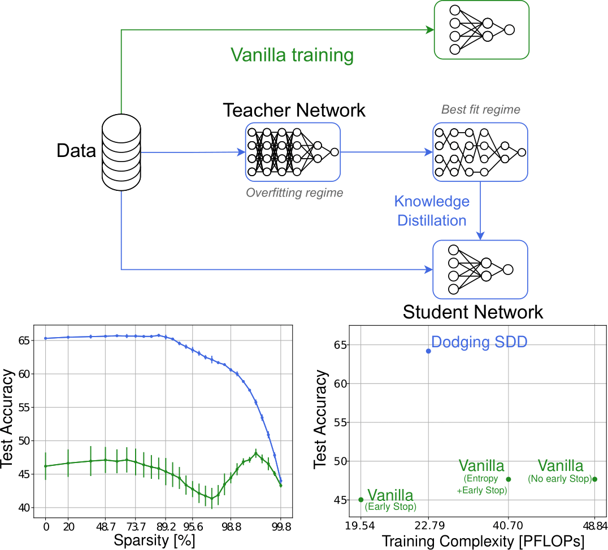

# DSD<sup>2</sup> : can we Dodge Sparse Double Descent and compress the neural network worry-free?

[](https://arxiv.org/abs/2303.01213.pdf)

This GitHub implements the key experiments of the following paper : [DSD<sup>2</sup> : can we Dodge Sparse Double Descent and compress the neural network worry-free?](https://arxiv.org/abs/2303.01213.pdf).

<p align="center">
  
</p>

## Libraries
* Python = 3.10
* PyTorch = 1.13
* Torchvision = 0.14
* Numpy = 1.23

## Usage

In practice, you can begin with a set of defaults and optionally modify individual hyperparameters as desired. To view the hyperparameters for each subcommand, use the following command. 
```
main.py [subcommand] [...] --help
```

## Example Runs

To run a ResNet-18 on CIFAR-10 with 10% of label noise, batch size of 128, learning rate of 0.1, weight decay of 1e-4 for 160 epochs:
```python main.py --data_path YOUR_PATH_TO_CIFAR --lr 0.1 --batch_size 128 --weight_decay 1e-4 --epochs 160```

To run a VGG-like model on CIFAR-100 with 20% of label noise, batch size of 128, learning rate of 0.1, and weight decay of 1e-4 for 160 epochs:
```python main.py --model VGG-like --dataset CIFAR-100 --data_path YOUR_PATH_TO_CIFAR --lr 0.1 --batch_size 128 --weight_decay 1e-4 --epochs 160 --amount_noise 0.2```

To run a VGG-like model distilled from a ResNet-18 teacher on CIFAR-10 with 50% of label noise:
```python kd.py --teacher_model=ResNet-18 --path_to_teacher_model YOUR_PATH_TO_TEACHER_MODEL --student_model VGG-like --dataset CIFAR-10 --data_path YOUR_PATH_TO_CIFAR --lr 0.1 --batch_size 128 --weight_decay 1e-4 --epochs 160 --amount_noise 0.5```

To calculate the entropy of the pruned ResNet-18 on CIFAR-10:
```python entropy.py --model_path YOUR_PATH_TO_PRUNED_MODELS --dataset CIFAR-10 --data_path YOUR_PATH_TO_CIFAR --arch ResNet-18```

## Citation
If you find this useful for your research, please cite the following paper.
```
@inproceedings{quetu2024dsd2,
  title={DSD$^2$: Can We Dodge Sparse Double Descent and Compress the Neural Network Worry-Free?},
  author={Qu{\'e}tu, Victor and Tartaglione, Enzo},
  booktitle={Proceedings of the AAAI Conference on Artificial Intelligence},
  volume={38},
  number={13},
  pages={14749--14757},
  year={2024}
}
```
